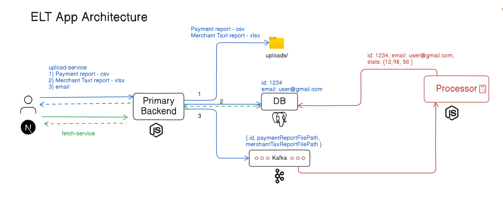

# ELT Application

A Simple ELT Application, which handles uploading and processing of payment, tax reports

## Tech Stack

- **Node.js**, **Express.js**, **Next.js**, **PostgreSQL**, **Kafka**

## Local Setup

Clone the repo

```bash
https://github.com/SanjayM-2002/elt-app.git
```

Start Kafka locally

```bash
docker run -p 9092:9092 apache/kafka:3.8.0
```

Set up .env in root and install node_modules in every service:

```bash
cd primary-backend
PORT = 5000
DATABASE_URL = ""
npm i
```

```bash
cd processor-service
PORT = 5001
DATABASE_URL = ""
npm i
```

```bash
cd elt-client
npm i
```

## Documentation

[Doc Link](https://docs.google.com/document/d/1lcUQ4PTVZUZzbByhmRW8fcuKAuhBZI5nkWuTEG6y9jk/edit?usp=sharing)

## Architecture



## License

[MIT](https://choosealicense.com/licenses/mit/)
